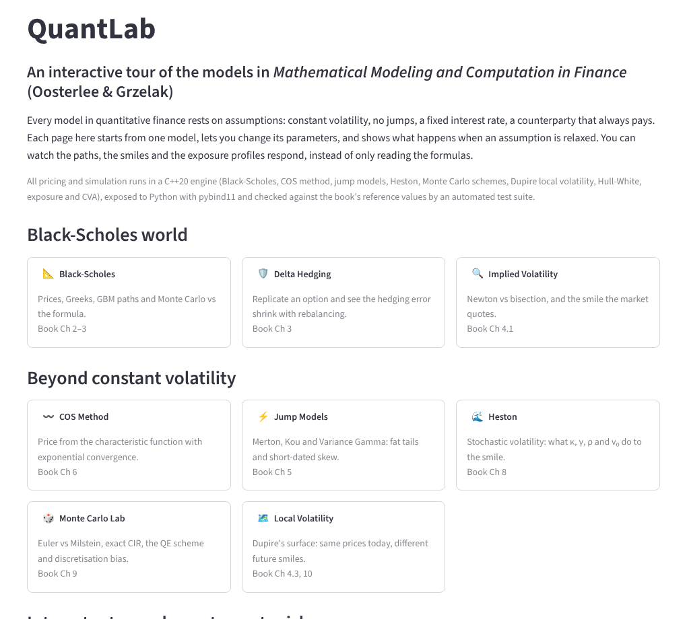
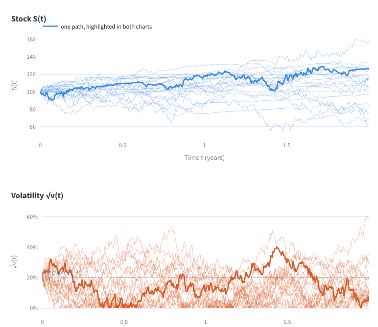
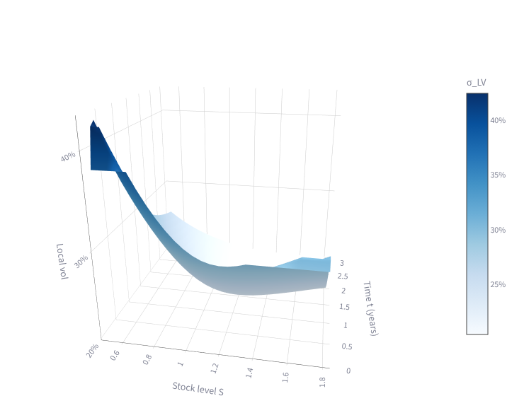
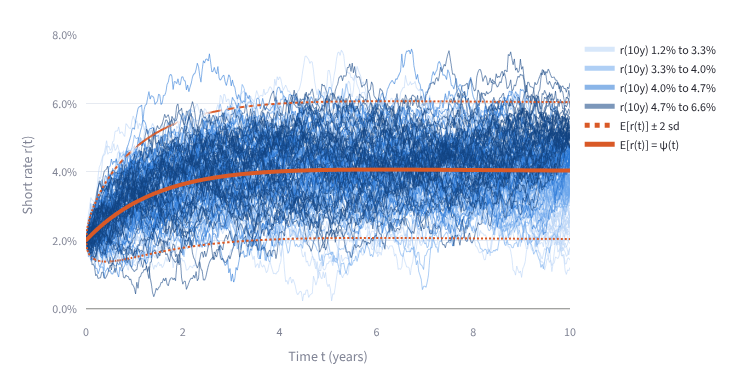
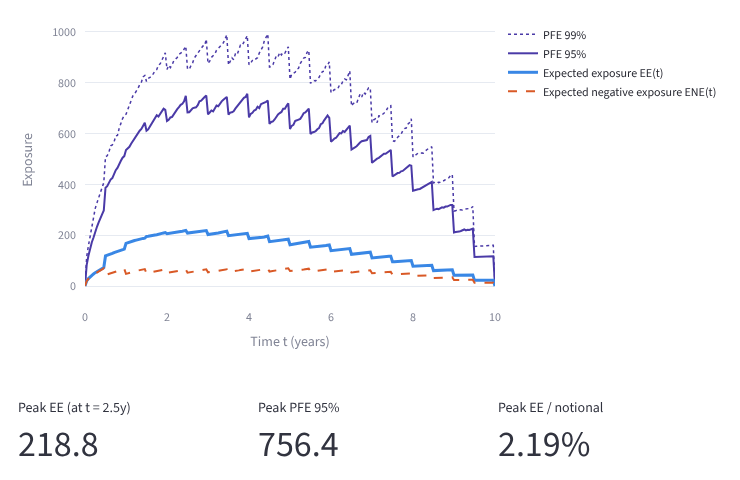

# QuantLab

[](https://github.com/solven139/quantlab/actions/workflows/tests.yml)

**An interactive tour of the models in *Mathematical Modeling and Computation in Finance* (Oosterlee & Grzelak), built on a C++20 pricing engine.**

▶ Live app: [quantlab-scottc.streamlit.app](https://quantlab-scott.streamlit.app)**

Every model in quantitative finance rests on assumptions: constant volatility, no jumps, a fixed interest rate, a counterparty that always pays. Each page of QuantLab starts from one model and lets you change its parameters and relax its assumptions. You watch the paths, smiles, surfaces and exposure profiles respond, instead of only reading the formulas.



## What's inside

| Page | Book | What you can explore |
|---|---|---|
| Black-Scholes | Ch 2–3 | Prices and Greeks, GBM paths, the lognormal density, Monte Carlo vs the formula |
| Delta Hedging | Ch 3 | Replicating an option; hedging error vs rebalancing frequency; hedging at the wrong volatility |
| Implied Volatility | Ch 4.1 | Newton vs bisection step by step, why plain Newton fails out of the money, smiles and a 3D surface |
| COS Method | Ch 6 | Recovering a density from its characteristic function; exponential convergence; COS vs Monte Carlo |
| Jump Models | Ch 5 | Merton, Kou and Variance Gamma paths, fat tails, the skew they create and how it fades with maturity |
| Heston | Ch 8 | Stochastic volatility paths, the Feller condition, what each parameter does to the smile |
| Monte Carlo Lab | Ch 9 | Strong/weak convergence of Euler vs Milstein; exact, QE and Euler sampling of CIR; Heston discretisation bias |
| Local Volatility | Ch 4.3, 10 | Dupire's surface from Heston prices; same smile today, different forward smile |
| Hull-White | Ch 11 | A short rate fitted to today's curve, θ(t), negative rates, future yield curves from one factor |
| Exposure and CVA | Ch 12 | Swap exposure paths, EE/PFE profiles, CVA and DVA from credit spreads, netting |

<table>
<tr>
<td><br><sub>Heston: stock and volatility paths</sub></td>
<td><br><sub>Dupire local volatility surface</sub></td>
</tr>
<tr>
<td><br><sub>Hull-White short-rate paths fitted to the curve</sub></td>
<td><br><sub>Swap exposure: EE, ENE and PFE</sub></td>
</tr>
</table>

## Validated against the book

Every model is checked by an automated test suite (168 tests) against closed forms, published reference values or independent Monte Carlo. Some results:

- **COS method:** the error falls from 14 to 2e-14 as the number of terms goes from 4 to 64 (exponential convergence). It is about 1000× faster than a 100k-path Monte Carlo, with error at rounding level.
- **Heston:** reproduces the Fang & Oosterlee reference price 5.785155450 to 8e-9.
- **Implied volatility:** reproduces book Example 4.1.2 (σ = 0.161482728841394) in 4 iterations, against 46 for pure bisection.
- **Merton:** COS matches the closed-form series to about 3e-13. Kou and Variance Gamma match independent Monte Carlo within 4 standard errors.
- **Monte Carlo schemes:** measured strong order is 0.49 for Euler and 0.96 for Milstein. For Heston with the Feller condition violated, Euler is biased by 13 standard errors, while the exact and QE schemes are unbiased from about 8 to 16 steps.
- **Local volatility:** Monte Carlo with Dupire's surface reproduces the Heston smile within about 0.2 vol points, while its forward smile is roughly half as steep (book Fig 10.2).
- **Hull-White:** Monte Carlo reprices today's yield curve to about 1 bp. A constant-θ Vasicek model misses the same curve by about 30 bp.
- **Exposure:** discounted swap values are martingales on the simulated paths. Netting an offsetting swap cuts CVA by about 45%.

## How it's built

```
cpp/include/quantlab/*.hpp, cpp/src/*.cpp   C++20 engine: models, COS, Monte Carlo, Dupire, Hull-White, exposure
cpp/bindings/module.cpp                     pybind11 bindings (NumPy arrays in and out)
python/quantlab/                            the Python package
tests/                                      pytest suite
app/Home.py, app/pages/                     Streamlit dashboard, one page per model
```

- **One pricer, many models.** Every model implements an abstract `Model` interface: its characteristic function and cumulants. The COS pricer depends only on that interface, so Merton, Kou, Variance Gamma and Heston were added without changing a line of the pricer (Strategy pattern / dependency inversion).
- **C++ for the numerics, Python for the interface.** Simulations of 10⁵ paths, Dupire surfaces and pathwise swap revaluation run in C++. The UI is plain Python with Plotly.
- **Build:** CMake + scikit-build-core compile the engine into a regular Python package with `pip install`.
- **CI:** GitHub Actions builds the engine and runs the full test suite on Linux and Windows for every push.

## Run it locally

You need Python 3.10+, CMake and a C++20 compiler (Visual Studio Build Tools on Windows, gcc or clang on Linux/macOS).

```bash
git clone https://github.com/solven139/quantlab.git
cd quantlab
python -m venv .venv
.venv\Scripts\Activate.ps1        # Windows PowerShell;  on Linux/macOS: source .venv/bin/activate
pip install -e ".[test]"          # compiles the C++ engine
pytest -q                         # 168 passed, 4 skipped
streamlit run app/Home.py
```

The 4 skipped tests are deliberate. Deep in-the-money options with no time value carry no information about volatility, so implied vol is undefined there.

## Reference

C. W. Oosterlee and L. A. Grzelak, *Mathematical Modeling and Computation in Finance: With Exercises and Python and MATLAB Computer Codes*, World Scientific, 2019.

---

Built by Scott-C (MSc Quantitative Finance, Singapore Management University) as a way to learn these models by building and testing them.
